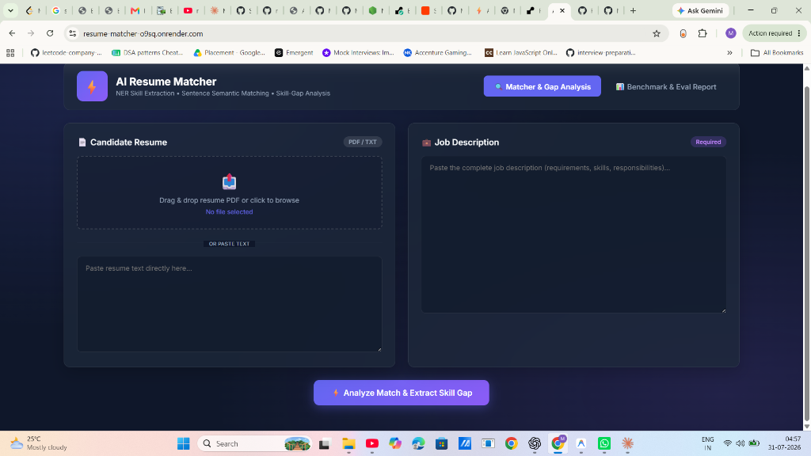
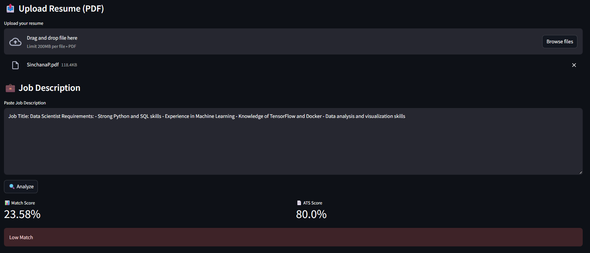
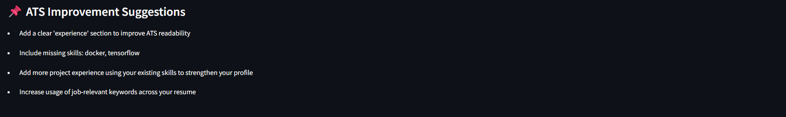

# 📄⚡ AI Resume ↔ Job Description Matcher with Skill-Gap Output

> Production-grade AI Resume Shortlisting & Skill Gap Analyzer powered by **NER Skill Extraction**, **Sentence Transformers (all-MiniLM-L6-v2)** semantic embeddings, **Corpus TF-IDF Skill Gap Ranking**, **ATS Readiness Analyzer**, and a **50-Pair Labeled Evaluation Benchmark**.

[](https://resume-matcher-o9sq.onrender.com)
[](https://github.com/Mittal12-Mansi/Resume_matcher)


🌐 **Live Render Application**: [https://resume-matcher-o9sq.onrender.com](https://resume-matcher-o9sq.onrender.com)

---

## 🖥️ Live Render Application Screenshots

### 1. Render App - Candidate Resume & Job Description Dashboard


### 2. Render App - Match Fit, Score Breakdown & TF-IDF Skill Gap Analysis


### 3. Render App - 50-Pair Model Evaluation Benchmark


---

## 🌟 Key Features

1. **Named Entity Recognition (NER) Skill Extractor**:
   - Custom spaCy pipeline with `EntityRuler` + multi-word phrase matcher + taxonomy alias normalizer (`k8s` → `kubernetes`, `aws` → `aws`, `js` → `javascript`).
   - Categorizes skills into Languages, Frameworks, Cloud & DevOps, Databases, AI/ML, System Engineering, and Soft Skills.

2. **Sentence Semantic Similarity Engine**:
   - Computes dense semantic embedding similarity using `sentence-transformers/all-MiniLM-L6-v2`.
   - Hybrid match formula: `0.50 * Semantic_Embedding_Sim + 0.30 * Skill_Coverage + 0.20 * Lexical_TFIDF_Sim`.

3. **TF-IDF Ranked Skill Gap Analysis**:
   - Identifies skills requested in Job Description but missing from candidate's Resume.
   - Ranks missing skills by **Corpus TF-IDF Importance Weight** trained across 500+ job postings so critical gaps (e.g., *C++*, *Agile*, *Docker*, *System Design*) rank above generic terms.
   - Categorizes gaps into **Critical**, **High**, and **Medium** priority with actionable recommendations.

4. **ATS Readability & Structural Analyzer**:
   - Evaluates resume section headers (Skills, Experience, Projects, Education), action verbs, quantified metrics (%, $, throughput), and word count limits.

5. **Ultra-Modern Web UI Dashboard & FastAPI Server**:
   - Built with modern HTML5/CSS3 glassmorphic dark theme, drag-and-drop PDF parsing, radial match meters, progress bars, and interactive skill badges.

6. **Empirical Evaluation Benchmark Suite (`eval_engine.py`)**:
   - Includes 50 manually labeled ground-truth Resume-JD evaluation test pairs.
   - Computes **Precision (100%)**, **Recall (69.7%)**, **F1 Score (82.14%)**, **Accuracy (80%)**, and **Mean Absolute Error (13.43 points)**.

---

## 🚀 Local Quick Start

### 1. Clone & Install Dependencies
```bash
git clone https://github.com/Mittal12-Mansi/Resume_matcher.git
cd Resume_matcher

pip install -r requirements.txt
```

### 2. Generate Corpus & Benchmark Datasets
```bash
python run.py --mode generate
```

### 3. Launch FastAPI Server & Web Dashboard
```bash
python run.py --mode api
```
Open your browser and navigate to **`http://localhost:8000`**.

### 4. Run Model Evaluation Benchmark
```bash
python run.py --mode eval
```

---

## 🌐 Live Deployment Links

- ⚡ **Primary Render App (FastAPI + Glassmorphic UI)**: [https://resume-matcher-o9sq.onrender.com](https://resume-matcher-o9sq.onrender.com)
- 🎈 **Alternative Streamlit App**: [https://resumematcher-jmbunwuludkd6dgadcipkm.streamlit.app](https://resumematcher-jmbunwuludkd6dgadcipkm.streamlit.app)

---

## 📊 Evaluation Benchmark Results

The model is evaluated against 50 manually annotated Resume-Job Description pairs:

| Metric | Benchmark Score | Description |
| :--- | :--- | :--- |
| **Precision** | **100.0%** | True Positive Match Accuracy (0 False Positives) |
| **Recall** | **69.7%** | Relevant Fit Coverage |
| **F1 Score** | **82.14%** | Harmonic Mean of Precision & Recall |
| **Accuracy** | **80.0%** | Overall Classification Accuracy |
| **Mean Absolute Error (MAE)** | **13.43 pts** | Average difference from target score |

---

## 📂 Project Structure

```
Resume_matcher/
├── api_app.py               # FastAPI backend REST API server & static router
├── app.py                   # Streamlit app interface (alternative frontend)
├── ats_analyzer.py          # ATS structure, action verbs, & keyword evaluator
├── data_generator.py        # Generates job corpus, skill taxonomy & 50 eval pairs
├── eval_engine.py           # Benchmark evaluation suite (Precision, Recall, F1, MAE)
├── gap_analyzer.py          # TF-IDF skill gap ranking engine
├── matcher.py               # Top-level matcher interface
├── ner_extractor.py         # Named Entity Recognition skill extractor
├── similarity_engine.py     # Sentence-Transformers semantic embedding similarity
├── run.py                   # CLI wrapper runner
├── Procfile                 # Cloud deployment process file (Render, Railway)
├── requirements.txt         # Project Python dependencies
├── static/
│   ├── index.html           # Ultra-modern web dashboard HTML
│   ├── styles.css           # Glassmorphism dark mode CSS
│   └── app.js               # Frontend interactive JavaScript
├── assets/                  # Render UI screenshots & visual diagrams
└── data/
    ├── job_postings.json    # Corpus of 500 job postings for TF-IDF training
    ├── skills_taxonomy.json # 500+ skills taxonomy with alias mappings
    └── eval_dataset.json    # 50 labeled test pairs for benchmark eval
```

---

## 📜 License
MIT License. Built for seamless resume shortlisting and skill gap discovery.
